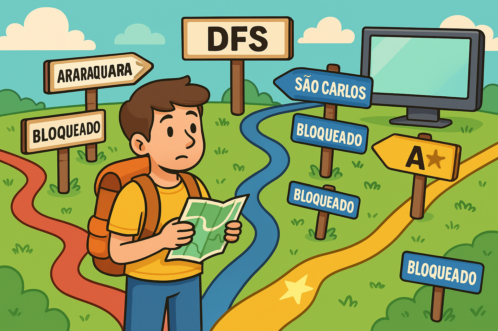

<h1 align="center">
    
    <p> An Artificial-Intelligence Programming Project! 🧠💻 </p>
</h1>

## 🚨 About

This is a project who implements differents kind of Search applied in a graph, and compare then!

## 🔨 Tools

- Depth-First Search
- Best-First Search
- A-star Search

## 🕹️ How to run

```bash
    # Clone the project
    $ git clone https://github.com/GuilhermeFincatti/IA.git

```

```bash
    # Enter directory
    $ cd IA
```

```bash
    # Compile and run
    $ python Buscas.py

```

## 📄 Work Organization

- Relatório: *Link para relatório*

- Slides: * Link para slides*


## 👥 Project Owners

- Gabriel Garcia

- Giovanni dos Santos

- Guilherme Augusto Fincatii da Silva

- Marcelo Eduardo Reginato

- Pedro Guilherme de Barros Zenatte

- Rhayna Christiani Vasconcelos Marques Casado